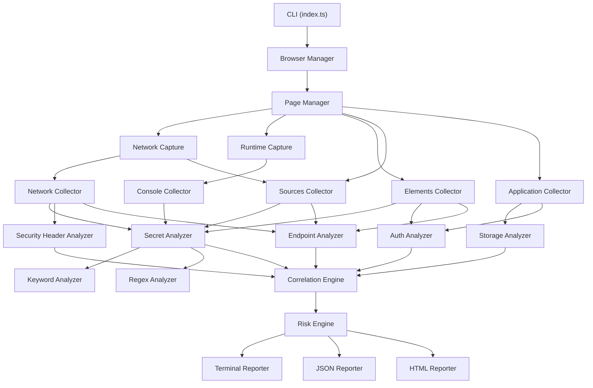

# DevInspect Security Auditor – Implementation Plan

A production-quality, passive web security auditing tool that inspects five Chromium DevTools surfaces (Elements, Sources, Network, Application, Console) for security-relevant indicators.

## Project Overview

| Aspect | Detail |
|---|---|
| **Runtime** | Node.js 18+, TypeScript strict mode |
| **Browser** | Playwright + Chromium (headless default) |
| **Output** | Terminal + JSON + HTML reports |
| **Execution** | `npm install && npm run build && npm start -- <URL>` |
| **Estimated files** | ~55 source files |

## Proposed Changes

### Project Root

#### [NEW] [package.json](file:///home/kavin/Documents/cyber%20lab/Broken%20URL%20RND/package.json)
- Dependencies: `playwright`, `commander`, `chalk`, `cli-table3`
- Dev dependencies: `typescript`, `vitest`, `@types/node`, `eslint`
- Scripts: `build`, `start`, `test`, `test:server`

#### [NEW] [tsconfig.json](file:///home/kavin/Documents/cyber%20lab/Broken%20URL%20RND/tsconfig.json)
- Strict mode, ES2022 target, Node16 module resolution

#### [NEW] [.eslintrc.json](file:///home/kavin/Documents/cyber%20lab/Broken%20URL%20RND/.eslintrc.json)
- TypeScript ESLint configuration

#### [NEW] [README.md](file:///home/kavin/Documents/cyber%20lab/Broken%20URL%20RND/README.md)
- Full documentation with all 18 sections specified

---

### Entry Point & Configuration

#### [NEW] [src/index.ts](file:///home/kavin/Documents/cyber%20lab/Broken%20URL%20RND/src/index.ts)
- CLI argument parsing with `commander`
- Orchestrates the full scan lifecycle: launch → collect → analyze → correlate → report → exit
- Graceful error handling and cleanup

#### [NEW] [src/config.ts](file:///home/kavin/Documents/cyber%20lab/Broken%20URL%20RND/src/config.ts)
- Central configuration interface and defaults (timeouts, max body size, redaction mode, context length, etc.)

---

### Models (`src/models/`)

#### [NEW] findings.ts
- `Finding` interface with id, title, category, severity, confidence, description, impact, remediation, evidence, sources, counts, timestamps
- Severity enum: INFO, LOW, MEDIUM, HIGH, CRITICAL
- Confidence enum: LOW, MEDIUM, HIGH
- Category enum for all finding categories

#### [NEW] network.ts
- `CapturedRequest` and `CapturedResponse` interfaces

#### [NEW] storage.ts
- Interfaces for cookies, localStorage, sessionStorage, IndexedDB, Cache Storage, Service Workers

#### [NEW] sources.ts
- Interfaces for captured source resources

---

### Browser Layer (`src/browser/`)

#### [NEW] browser-manager.ts
- Launch/close Chromium via Playwright
- Create isolated browser context with configurable options

#### [NEW] page-manager.ts
- Navigate to target URL, handle redirects, wait for DOMContentLoaded + network idle with timeout
- Configurable stabilization delay

#### [NEW] network-capture.ts
- Intercept all requests/responses via Playwright events
- Capture headers, status, body (bounded by max size), timing
- Handle aborted requests gracefully

#### [NEW] runtime-capture.ts
- Capture console messages and page errors via Playwright events

---

### Collectors (`src/collectors/`)

Each collector returns structured data for its DevTools surface.

#### [NEW] elements-collector.ts
- `page.content()` + `page.evaluate()` for DOM inspection
- Forms, inputs, links, buttons, iframes, scripts, comments, meta tags, data attributes, hidden containers

#### [NEW] sources-collector.ts
- Collect loaded text resources from network captures
- Parse inline scripts, extract source map references
- Extract endpoints from JS (fetch, axios, XHR, WebSocket patterns)

#### [NEW] network-collector.ts
- Aggregate captured network traffic
- Classify by resource type, status code
- Parse JSON response bodies recursively

#### [NEW] application-collector.ts
- Cookies via `context.cookies()`
- localStorage/sessionStorage via `page.evaluate()`
- IndexedDB via `page.evaluate()` with cycle-safe serialization
- Cache Storage via `page.evaluate()`
- Service Workers via CDP

#### [NEW] console-collector.ts
- Aggregate console messages captured by runtime-capture
- Classify by level, extract serializable arguments

---

### Rules (`src/rules/`)

#### [NEW] keywords.ts
- 80+ security-relevant keywords (case-insensitive matching)
- Categorized by type (PII, auth, financial, infrastructure, etc.)

#### [NEW] regex-rules.ts
- 17+ named regex patterns (email, phone, SSN, credit card + Luhn, JWT, AWS keys, private keys, IPs, DB strings, UUIDs, ObjectIds, API key params, Bearer tokens, Basic auth)

#### [NEW] security-rules.ts
- Cookie security rules, header security rules, storage security rules

---

### Analyzers (`src/analyzers/`)

#### [NEW] keyword-analyzer.ts
- Scan any text using keyword dictionary
- Case-insensitive, Unicode-aware, deduplication, context snippets

#### [NEW] regex-analyzer.ts
- Scan any text using regex rules
- Luhn validation for credit cards
- Context snippets, masking, deduplication

#### [NEW] secret-analyzer.ts
- Central facade combining keyword + regex analysis
- Classify matches by sensitivity level

#### [NEW] auth-analyzer.ts
- Passive auth indicator detection
- Analyze navigation state, auth-related DOM, client-side auth state

#### [NEW] security-header-analyzer.ts
- Analyze CSP, HSTS, X-Content-Type-Options, X-Frame-Options, Referrer-Policy, Permissions-Policy

#### [NEW] storage-analyzer.ts
- Cookie security checks (HttpOnly, Secure, SameSite, domain/path)
- localStorage/sessionStorage sensitive data detection

#### [NEW] endpoint-analyzer.ts
- Classify discovered endpoints by risk (admin, internal, API, debug)
- Correlate endpoints across DOM, sources, and network

#### [NEW] correlation-engine.ts
- **Key component**: Cross-reference evidence across all 5 surfaces
- Group related observations into correlated findings
- Elevate severity/confidence when multiple surfaces corroborate

#### [NEW] risk-engine.ts
- Calculate final severity and confidence for each finding
- Deduplication using normalized values
- Apply correlation bonuses/penalties

---

### Reporting (`src/reporting/`)

#### [NEW] terminal-reporter.ts
- Formatted terminal output using `chalk` + `cli-table3`
- Risk summary, high-confidence findings, evidence snippets
- Respects redaction mode

#### [NEW] json-reporter.ts
- Structured JSON report with full schema
- Metadata, navigation, all 5 surfaces, findings, summary, config

#### [NEW] html-reporter.ts
- Self-contained HTML report with embedded CSS/JS
- Executive summary, risk summary, filterable findings
- Severity badges, evidence sections, remediation guidance

---

### Utilities (`src/utils/`)

#### [NEW] logger.ts
- Structured logging with levels (debug, info, warn, error)
- Respects --verbose flag

#### [NEW] redaction.ts
- `maskSensitiveValue(value, type)` with SAFE/BALANCED/FORENSIC modes
- Type-specific masking (email, JWT, AWS key, CC, SSN, etc.)

#### [NEW] hashing.ts
- SHA-256 hashing for deduplication and cookie value fingerprinting

#### [NEW] snippets.ts
- Context snippet extraction (configurable window, default ~30 chars)
- Safe truncation

#### [NEW] normalization.ts
- Value normalization for deduplication (email case, UUID lowercase, whitespace, URL params)

---

### Tests (`src/tests/`)

#### [NEW] test-server.ts
- Express-based test web app serving deliberately seeded fake data
- Routes: `/internal/dashboard`, `/api/employees`, `/api/config`, `/login`, `/admin`
- Fake PII, fake tokens, insecure cookies, debug info in console

#### [NEW] regex-analyzer.test.ts
- Email, phone, SSN, credit card + Luhn, JWT, AWS key, private key, internal IP, DB URL, UUID, API key param detection

#### [NEW] keyword-analyzer.test.ts
- Keyword scanning, deduplication, context snippets

#### [NEW] storage-analyzer.test.ts
- Cookie security analysis, localStorage analysis

#### [NEW] risk-engine.test.ts
- Risk scoring, deduplication

#### [NEW] redaction.test.ts
- All masking modes and types

#### [NEW] snippet.test.ts
- Snippet generation, edge cases

#### [NEW] integration.test.ts
- Full scan against test server (launches browser)

---

## Architecture Diagram



## Data Flow

1. **Launch** → Playwright launches Chromium, creates isolated context
2. **Navigate** → Page manager navigates to target, network/runtime capture begins
3. **Wait** → DOMContentLoaded + network idle (with timeout fallback) + stabilization delay
4. **Collect** → All 5 collectors run in parallel where possible
5. **Analyze** → Each collector's data runs through relevant analyzers
6. **Correlate** → Correlation engine cross-references findings across surfaces
7. **Score** → Risk engine assigns final severity/confidence, deduplicates
8. **Report** → All 3 reporters generate output
9. **Cleanup** → Browser closes, process exits

## Key Design Decisions

1. **Passive-only scanning** — No request modification, no attack payloads, no auth bypass attempts
2. **Bounded collection** — All body captures respect `maxBodySize`, console capped at 1000 entries, snippet collections bounded
3. **Cycle-safe serialization** — IndexedDB/storage inspection uses `JSON.stringify` with replacer to handle circular refs
4. **Correlation over alerting** — Single keyword matches produce INFO findings; correlated multi-surface evidence elevates to HIGH
5. **Redaction by default** — SAFE mode redacts all sensitive values in terminal output; JSON/HTML respect configured mode

## Verification Plan

### Automated Tests
```bash
npm test                    # Unit tests via vitest
npm run test:integration    # Full scan against test server
```

### Manual Verification
```bash
# Build and run against included test server
npm run build
node dist/tests/test-server.js &
npm start -- "http://localhost:54321/internal/dashboard" --html report.html
# Inspect terminal output, JSON report, and HTML report
kill %1
```

> [!IMPORTANT]
> This is a large project (~55 files, ~8000+ lines). Execution will be done methodically, module by module, with compilation checks between major milestones.

> [!NOTE]
> All test data uses synthetic/fake values only. No real credentials, PII, or secrets will appear in any fixture or test file.
